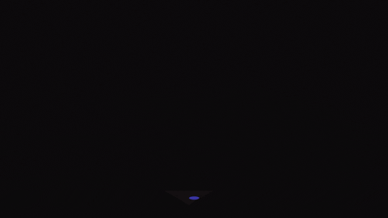

👋I'm Melika Karimi 

👩🏻‍💻I’m junior Front-End develpoer

💻I’m currently learning React js framework 

🧲I was interested in learning Python and now I am also learning Python 

🤝🏻I’m looking to collaborate on React js project in a company 

<!--
**Melika-Ka/Melika-Ka** is a ✨ _special_ ✨ repository because its `README.md` (this file) appears on your GitHub profile.
Here are some ideas to get you started:
- 🔭 I’m currently working on ...
- 🌱 I’m currently learning ...
- 👯 I’m looking to collaborate on ...
- 🤔 I’m looking for help with ...
- 💬 Ask me about ...
- 📫 How to reach me: ...
- 😄 Pronouns: ...
- ⚡ Fun fact: ...
-->

	
  
<b>GitHub Stats</b>

  

	
  
<b>My Top Langs </b>

 

